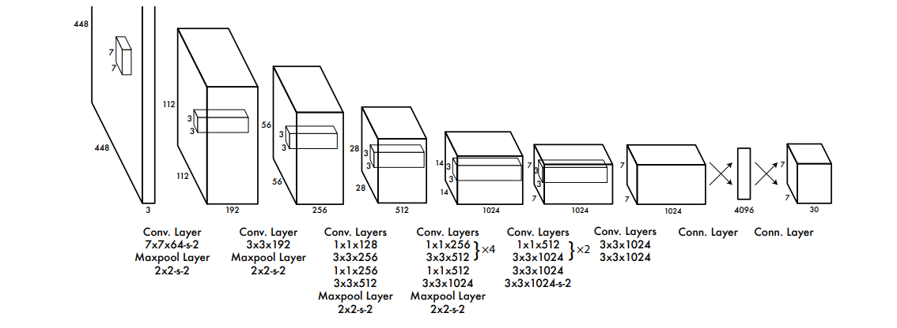
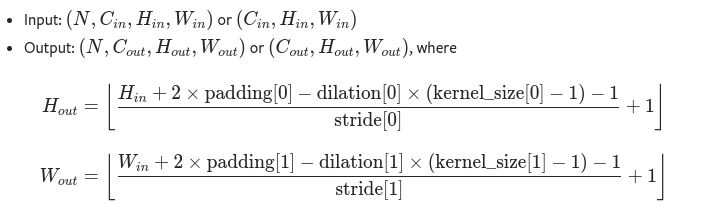
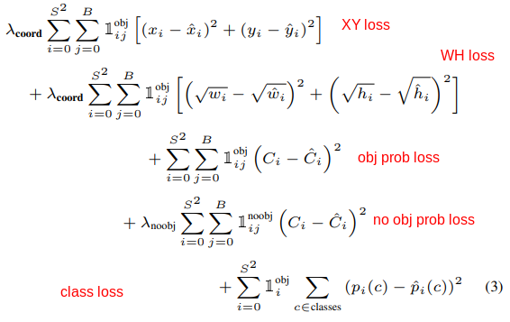
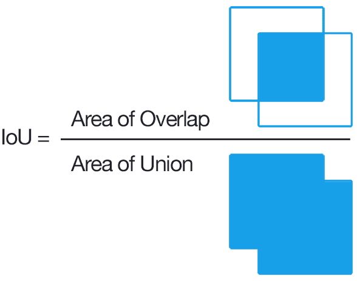

[Github](https://github.com/ahtabrizi/AI-Expedition/tree/main/Pytorch/YOLO)


You Only Look Once (YOLO) is a pioneering object detection algorithm that revolutionized the field of computer vision. Developed by Joseph Redmon and Santosh Divvala, YOLOv1 introduced a novel approach to real-time object detection by dividing an image into a grid and predicting bounding boxes and class probabilities for each grid cell. This single-pass architecture significantly improved detection speed without compromising accuracy, making it a go-to choice for various applications, including autonomous vehicles, surveillance systems, and image recognition. The simplicity and efficiency of YOLOv1 marked a milestone in the evolution of object detection algorithms, setting the stage for further advancements in the field.

I know that this is a relatively old model and there are lot of implementations available, but this model holds a significant place in onbject detection research and I thought implementing it from scratch would be a good review on the basics.

If you are interested, read the [paper](https://arxiv.org/pdf/1506.02640v5.pdf)!

---------------------------------------------------------

# How it works
- The input image in the paper is RGB and has (3, 448, 448) shape.
- The input image is divided into a grid, typically with S x S cells. (S = 7 in the paper)
- Each grid cell predicts multiple bounding boxes(denoted by B, B=2 in the paper)
- Each bounding box is characterized by five parameters: (x, y) coordinates of the bounding box's center relative to the grid cell, width (w), height (h) of the bounding box with respect to Width and Height of the input image, and a confidence score representing the likelihood of containing an object.
  
  So for each bounding box we have bbox = [c_obj, x, y, w, h].
  Note that order of variables does not matter as long as you stick with an order through out your code.
- Each grid cell also predicts class probabilities for the objects present within its boundaries.

  Since YOLOv1 oroiginaly was trained on Pascal VOC 2007 and 2012 datasets. We are going to use 2012 version only. There is only 20 classes of objects in the dataset. So we need 20 additional outputs to tell us the class of each bounding box, where highest probability between these 20 outputs will be our detected class. (this number is denoted by C)

- Including the classes, the predicion for each grid cell is going to be in the format of: [classes , bbox_1, bbox_2] -> 30 values
  
  As you an see each grid cell can only detect two bounding boxes but with the same class type.
- The output of the model should have the shpe of (7, 7, 30) as indicated in the paper (S, S, C + B x 5).

---------------------------------------------------------

# Loading data from Pascal VOC dataset 
The [Pascal VOC dataset](http://host.robots.ox.ac.uk/pascal/VOC/) is a dataet for object detection. The main versions are 2007 and 2012. We are going to use 2012 version.

Classes included in this dataset are:
("aeroplane", "bicycle", "bird", "boat", "bottle", "bus", "car", "cat", "chair", "cow", "diningtable", "dog", "horse", "motorbike", "person", "pottedplant", "sheep", "sofa", "train", "tvmonitor").

To download it you can use PyTorch's `VOCDetection` helper class: 
```python
from torchvision.datasets.voc import VOCDetection
dataset = VOCDetection(
    root=config.DATA_PATH,
    year="2012",
    image_set=("train" if type == "train" else "val"),
    download=download,
    transform=T.Compose(
        [
            T.PILToTensor(),
            T.Resize(config.IMAGE_SIZE),
            T.ToDtype(torch.float32, scale=True),
        ]
    ),
)
```
As you can see you have to determine path to store the data (root), year, train or val type, download or load from disk and transforms.
This is a initial trnsform to convert the loaded image to Tensor and then resize to the shape of model input. Changing the datatype from uint8 to float32 is neceary since we gonna normalize image later.

Each image has a XML label that determines the class, bounding box coordinates and image size. It has some other data but we don't need it. 


As you can see it jost provides us with two points in the bounding box, but YOLOv1 output should be in format of center coordinates, width, and height. In order to do that we need to calculate it and to avoid instbility it is normalized to between [0, 1]:


## Data augmentation
In order to increase model robustness and data and to avoid overfitting, data augmentation is used. Based on the paper they have applied random scaling and translations, randomly adjusting exposure and staturation in HSV color space. In order to achieve this we use following transformation from PyTorch: 

```python
x_shift = int((0.2 * random.random() - 0.1) * config.IMAGE_SIZE[0])
y_shift = int((0.2 * random.random() - 0.1) * config.IMAGE_SIZE[1])
scale = 1 + 0.2 * random.random()

# Augment images
if self.augment:
    data = TF.affine(data, angle=0.0, scale=scale, translate=(x_shift, y_shift), shear=0.0)
    data = TF.adjust_hue(data, 0.2 * random.random() - 0.1)
    data = TF.adjust_saturation(data, 0.2 * random.random() + 0.9)
```
These are the original augmentation tehniques that are used in paper. You can add other transformations. But beware to recalculate the bbox locations based on transformations used. Here we have to recalculate for scale and shifts, because only these transformations effect the bbox locations.

## Normalize
Normalizing the input image (or any other type of input) usually has lots of benefits such as:
- Stability during trainig: helps prevent issues like exploding or vanishing gradients during training.
- Faster Convergnce
- Avoiding Saturation of activation functions: Most of activation functions work best on normalized values.
- Compatibility with pre-trained models

```python
data = TF.normalize(data, mean=[0.485, 0.456, 0.406], std=[0.229, 0.224, 0.225])
```
The reason that everyone uses these values as mean and std is interesting. It is remnant of ImageNet dataset and competitions and it has become defcto standard in many vision applicaitons.


## Confidence
Since each bbox has a class and is annotated by human, we are sure that there is object present provided coordinates. Therefore we will set the confidence of each object and corresponding class to 1.0.


---------------------------------------------------------

# YOLO Architecture

The original arhitecture in the paper uses [Darknet19](https://pjreddie.com/darknet/imagenet/#extraction) backbone. 




As you can see, it takes 3x448x448 rgb image. The outout is 7x7x30 (refer to [How it works](#how-it-works) section).
We have to calculate padding of each layer, since paddings are not inluded in the architecture description. In order to calculate that we have to reverse the following formula that calculates output sizes of convoltion and MaxPool layers ([ref](https://pytorch.org/docs/stable/generated/torch.nn.Conv2d.html)):



where dilation is 1 (dialation makes convoltion layer to skip pixel in the output, not important for YOLOv1). By calculating the padding we can have the whole structure figured out. I have separated the backbone and Head of the model, and I connect them together to make the whole model. The reason is that to train the model, I don't have enough resources to train it from scratch on ImageNet dataset and then fine tune it on Pascal VOC. In paper, originaly they have trained it for one week on ImageNet 2012 to achive 88% accuracy. 

In order to train the model faster, I'm gonna use pretrained ResNet50 (trained on imagenet) and then just modify the output layers and train only these layers (not the backbone). So the Head module of the model is going to be the same for both models:

```python
class YOLOv1(nn.Module):
    def __init__(self, pretrained=True):
        super().__init__()

        if pretrained:
            self.model = nn.Sequential(Resnet_Backbone(), Head_Module())
        else:
            self.model = nn.Sequential(YOLO_from_scratch_backbone(), Head_Module())

    def forward(self, x):
        return self.model.forward(x)
```

In the Head model we have two Fully Connected layers. It also has a dropout after first layer. we need to reshape the last layer to the output shape we want  (7x7x30).
```python
class Head_Module(nn.Module):
    def __init__(self):
        super().__init__()
        self.depth = config.B * 5 + config.C

        layers = []
        layers += [
            nn.Flatten(),
            # FC 1
            nn.Linear(config.S * config.S * 1024, 4096),
            nn.Dropout(p=0.5),
            nn.LeakyReLU(negative_slope=0.1),
            # FC 2
            nn.Linear(4096, config.S * config.S * self.depth),
            nn.Sigmoid(),
        ]

        self.model = nn.Sequential(*layers)

    def forward(self, x):
        return torch.reshape(self.model.forward(x), (x.size(dim=0), config.S, config.S, self.depth))
```
---------------------------
# Loss function
In order to calculate the grdient we need a value to calculate the overall accuracy of the model. In the paper, the loss funcion is. 



where `1_obj_i` denote if object appears in cell i, and `1_obj_ij` denotes that the jth bounding box predictor in cell i is responsible for the prediction. Responsible means that the predicted bbox hsa largest overlap (IOU) with the ground truth. So for each predicted bbox we need to calculate the Intersetion Over Unoion (IOU) with ground truth (label) bbox and only keep the prediction with maximum IOU (non max suppression).

By looking at the output of the model, we can see mot prts of the loss function are intuitive. 
- XY loss: this part calculates the loss for error in the predicted box's center coordinates. It uses mean squared error (`mse`). `labmda_coord` is constant and its value is 5.
- WH loss: calculates the loss error for the error in the predicted box's width and height. It uses mean squared error (`mse`). `labmda_coord` is constant and its value is 5.
Note that w and h are under square root, the reason is that this metric should reflect that small deviations in large boxes matter less than small boxes. In other words we try to define it in a way to equally detect large and small objects in the image, so we smooth out the large values by applying square root.
- obj prob loss: If there is a object in current cell (ith cell), calculte the mse error of confidene (probability) of the one with highest IOU(responsible bbox) with respect to ground truth confidence (which is 1)
- no obj prob loss: In the last part we only penalized if there is a bbox responsible, but we also need to penalize bboxes that are not responsible to suppress them in future inferences. `labmda_noobj` is constant and its value is 0.5.
The reason that this constant is 100x smaller than the `labmda_coord` is we perefer to detect object than not detecting it at all. Meaning gradient from coordiaes losses will overpower confidence loss, so we gonna get bboxes with low (or close to zero) confidence.

As stated in the paper:

    We use sum-squared error because it is easy to optimize, however it does not perfectly align with our goal of
    maximizing average precision. It weights localization error equally with classification error which may not be ideal.
    Also, in every image many grid cells do not contain any
    object. This pushes the “confidence” scores of those cells
    towards zero, often overpowering the gradient from cells
    that do contain objects. This can lead to model instability,
    causing training to diverge early on.
    To remedy this, we increase the loss from bounding box
    coordinate predictions and decrease the loss from confidence predictions for boxes that don’t contain objects. We
    use two parameters, λcoord and λnoobj to accomplish this. We
    set λcoord = 5 and λnoobj = .5.

- class loss: To recognize the object class we penalize class type if there is object in the cell. ground truth is 1 for the correponding class.

## IOU (intersection over union)
It is a metric used in objet detection to evluate accuracy of the predicted bounding boxes compared to ground truth bounding boxes (essentially calcultes the overlap).  

#### Formula
IOU = (Area of Intersection) / (Area of Union)


#### Process to calculate it:
1. Get two bboxes, one predicted and one ground truth.
2. Calculate area of intersetion: use min and max of X and Y of the boxes to get overlap X and Y. Then multiply to get the area. X = x2-x1 and Y = y2-y1. If any of X and Y are smaller than 0 (negative), it means there  no intersection so we clamp it to zero.
```python
# Calculate intersection points
x1 = torch.max(box1_x1, box2_x1)
x2 = torch.min(box1_x2, box2_x2)
y1 = torch.max(box1_y1, box2_y1)
y2 = torch.min(box1_y2, box2_y2)

# Calculate the intersection area
# Clamp by 0 when there is no intersection
intersection = (x2 - x1).clamp(0) * (y2 - y1).clamp(0)
```
3. calculate the union area:
  union = area_bbox_predicted + area_bbox_ground_truth - intersection_area.

  we add an Epsilon (small amount) to void division by zero in the next step in case union is zero.

4. calculate iou: intersection / union

## Non max suppression
It is a technique to keep only the most relevent bounding boxes for each object. 

#### Process
1. Sort bboxes based on confidence scores, with the highest score first.
2. Select next bbox in the sorted list
3. Calculate the IOU of the selected bbox with all other bboxes
4. Suppress overlapping boxes, remove bboxes that have high IOU (over threshold) with the selected bounding box.
  This ensures that redundant detections or highly overlapping but lower confidence bboxes are removed.
5. Repeat steps 2 to 4 until all of the boxes are processed

Note: In the following code I use a set() to keep track of suppressed bboxes. I add to this list if bbox is not the selected bbox, classes are the same and IOU is more than the threshold.

```python
def nms(bboxes, iou_threshold):
    """
    Perform non-maximum suppression on a list of bounding boxes.

    Parameters:
    - bboxes (List[List[float]]): List of bounding boxes.
    - iou_threshold (float): IoU threshold for suppression.

    Returns:
    - List[List[float]]: Suppressed bounding boxes.
    """
    result = []
    num_boxes = len(bboxes)

    # Sort based on confidence
    bboxes.sort(key=lambda x: x[4], reverse=True)

    bboxes = torch.Tensor(bboxes).unsqueeze(1)
    suppressed = set()
    # Overlap Check
    for i in range(num_boxes):
        if i in suppressed:
            continue

        curbox = bboxes[i]
        ious = get_iou(curbox[..., 0:4], bboxes[..., 0:4], "corner")

        # curbox = [x1, y1, x2, y2, confidence, class_index]
        for j in range(i + 1, num_boxes):
            if i != j and curbox[0, -1] == bboxes[j, 0, -1] and ious[j].item() > iou_threshold:
                suppressed.add(j)

    for i in range(num_boxes):
        if i not in suppressed:
            result.append(bboxes[i][0])
    return result
```
There is another way to go about nms, in that you use argsort to sort the indices(not the bboxes) and add bbox to result evety loop. This way you have the modify and delete the suppress bbox indices. But in the end they output the same result, maybe I develope the second way later!

## Loss Code
- Calculate IOUs:
    First we calculate the ious for each predition(there are B number of predicitons). Next we find which prediction has the highest IOU. In other words is reponsible for the prediction.

    Note this code is written for only B=2. I might upgrde it to use variable B.
```python
# Calculate the iou's for each bbox in each cell - (batch, S, S)
iou_b1 = get_iou(preds[..., 21:25], targets[..., 21:25])
iou_b2 = get_iou(preds[..., 26:30], targets[..., 26:30])

_, bestbox_indices = torch.max(torch.stack([iou_b1, iou_b2]), dim=0)  # (batch, S, S)
```
`bestbox_indices` is a matrix which tells us in each grid cell which prediction is responsible for the detection. In case of B=2, 0 is the first and 1 is the second prediction. (refer to [How it Works](#how-it-works) to understand B)

We are going to use this matrix to calculate obj_ij and later the loss by multiplying it to other matrices. Since any number ecxept 1, will just ruin the loss for that prediction(in case B=2, 0), we have to create a matrix that each value is one if there is object in that cell. To differentite between prediction, we just stack them together. For example in the following code snippet, we stack two `bestbox_indices` together but convert the 0s to 1 for the first matrix.

```python
responsible = torch.stack([1 - bestbox_indices, bestbox_indices], dim=-1)
```
- Obj_i: To see if there is object in the ith cell, the fisrt confidene score should be greater than zero.
```python
obj_i = targets[..., 20].unsqueeze(3) > 0.0 
```

- Obj_ij and noobj_ij:
```python
# exists * responsible
obj_ij = obj_i * responsible
noobj_ij = 1 - obj_ij
```
- XY loss:
```python
# XY losses
x_loss = self.mse_loss(obj_ij * bbox_attr(preds, 1), obj_ij * bbox_attr(targets, 1))
y_loss = self.mse_loss(obj_ij * bbox_attr(preds, 2), obj_ij * bbox_attr(targets, 2))
xy_loss = x_loss + y_loss
```

- WH loss:

```python
# WH losses
p_width = bbox_attr(preds, 3)  # (batch, S, S, B)
t_width = bbox_attr(targets, 3)  # (batch, S, S, B)

# since predicted width can be negative we use abs. To accomodate for gradient going to zero,
# we add epsilon. To preserve gradient direction we add sign
width_loss = self.mse_loss(
    obj_ij * torch.sign(p_width) * torch.sqrt(torch.abs(p_width) + config.EPSILON),
    obj_ij * torch.sqrt(t_width),
)
p_height = bbox_attr(preds, 4)  # (batch, S, S, B)
t_height = bbox_attr(targets, 4)  # (batch, S, S, B)
height_loss = self.mse_loss(
    obj_ij * torch.sign(p_height) * torch.sqrt(torch.abs(p_height) + config.EPSILON),
    obj_ij * torch.sqrt(t_height),
)
wh_loss = width_loss + height_loss
```
Note tht we do not use sign and abs functions on target w and h, since we are sure that these values are positive.

- Confidence loss:
```python
# Condifdence losses
obj_confidence_loss = self.mse_loss(obj_ij * bbox_attr(preds, 0), obj_ij * bbox_attr(targets, 0))
noobj_confidence_loss = self.mse_loss(noobj_ij * bbox_attr(preds, 0), noobj_ij * bbox_attr(targets, 0))
```
- class and total loss:
```python
# Class losses
class_loss = self.mse_loss(obj_i * preds[..., : config.C], obj_i * targets[..., : config.C])
total_loss = (
    self.lambda_coord * (xy_loss + wh_loss)
    + obj_confidence_loss
    + self.lambda_noobj * noobj_confidence_loss
    + class_loss
)
```

---------------------------

# Train

Just a simple pytorch trian loop.
```python
for data, labels, _ in tqdm_dataloader:
    data = data.to(device)
    labels = labels.to(device)

    optimizer.zero_grad()
    outputs = model(data)
    loss = loss_fn(outputs, labels)
    loss.backward()

    optimizer.step()
```