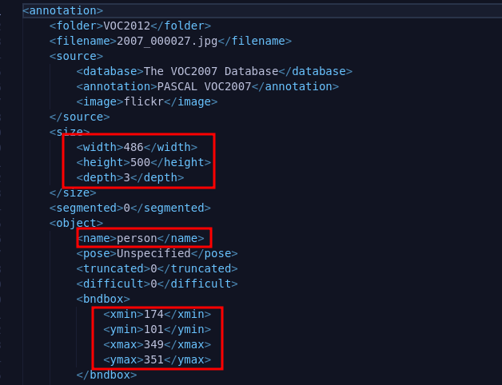
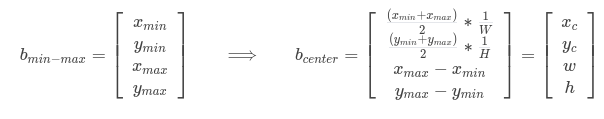

[Github](https://github.com/ahtabrizi/AI-Expedition/tree/main/Pytorch/YOLO)


You Only Look Once (YOLO) is a pioneering object detection algorithm that revolutionized the field of computer vision. Developed by Joseph Redmon and Santosh Divvala, YOLOv1 introduced a novel approach to real-time object detection by dividing an image into a grid and predicting bounding boxes and class probabilities for each grid cell. This single-pass architecture significantly improved detection speed without compromising accuracy, making it a go-to choice for various applications, including autonomous vehicles, surveillance systems, and image recognition. The simplicity and efficiency of YOLOv1 marked a milestone in the evolution of object detection algorithms, setting the stage for further advancements in the field.

I know that this is a relatively old model and there are lot of implementations available, but this model holds a significant place in onbject detection research and I thought implementing it from scratch would be a good review on the basics.

If you are interested, read the [paper](https://arxiv.org/pdf/1506.02640v5.pdf)!

---------------------------------------------------------

# How it works
- The input image in the paper is RGB and has (3, 448, 448) shape.
- The input image is divided into a grid, typically with S x S cells. (S = 7 in the paper)
- Each grid cell predicts multiple bounding boxes(denoted by B, B=2 in the paper)
- Each bounding box is characterized by five parameters: (x, y) coordinates of the bounding box's center relative to the grid cell, width (w), height (h) of the bounding box with respect to Width and Height of the input image, and a confidence score representing the likelihood of containing an object.
  
  So for each bounding box we have bbox = [c_obj, x, y, w, h].
  Note that order of variables does not matter as long as you stick with an order through out your code.
- Each grid cell also predicts class probabilities for the objects present within its boundaries.

  Since YOLOv1 oroiginaly was trained on Pascal VOC 2007 and 2012 datasets. We are going to use 2012 version only. There is only 20 classes of objects in the dataset. So we need 20 additional outputs to tell us the class of each bounding box, where highest probability between these 20 outputs will be our detected class. (this number is denoted by C)

- Including the classes, the predicion for each grid cell is going to be in the format of: [classes , bbox_1, bbox_2] -> 30 values
  
  As you an see each grid cell can only detect two bounding boxes but with the same class type.
- The output of the model should have the shpe of (7, 7, 30) as indicated in the paper (S, S, C + B x 5).

---------------------------------------------------------

# Loading data from Pascal VOC dataset 
The [Pascal VOC dataset](http://host.robots.ox.ac.uk/pascal/VOC/) is a dataet for object detection. The main versions are 2007 and 2012. We are going to use 2012 version.

Classes included in this dataset are:
("aeroplane", "bicycle", "bird", "boat", "bottle", "bus", "car", "cat", "chair", "cow", "diningtable", "dog", "horse", "motorbike", "person", "pottedplant", "sheep", "sofa", "train", "tvmonitor").

To download it you can use PyTorch's `VOCDetection` helper class: 
```python
from torchvision.datasets.voc import VOCDetection
dataset = VOCDetection(
    root=config.DATA_PATH,
    year="2012",
    image_set=("train" if type == "train" else "val"),
    download=download,
    transform=T.Compose(
        [
            T.PILToTensor(),
            T.Resize(config.IMAGE_SIZE),
            T.ToDtype(torch.float32, scale=True),
        ]
    ),
)
```
As you can see you have to determine path to store the data (root), year, train or val type, download or load from disk and transforms.
This is a initial trnsform to convert the loaded image to Tensor and then resize to the shape of model input. Changing the datatype from uint8 to float32 is neceary since we gonna normalize image later.

Each image has a XML label that determines the class, bounding box coordinates and image size. It has some other data but we don't need it. 



As you can see it jost provides us with two points in the bounding box, but YOLOv1 output should be in format of center coordinates, width, and height. In order to do that we need to calculate it and to avoid instbility it is normalized to between [0, 1]:




## Data augmentation
In order to increase model robustness and data and to avoid overfitting, data augmentation is used. Based on the paper they have applied random scaling and translations, randomly adjusting exposure and staturation in HSV color space. In order to achieve this we use following transformation from PyTorch: 

```python
x_shift = int((0.2 * random.random() - 0.1) * config.IMAGE_SIZE[0])
y_shift = int((0.2 * random.random() - 0.1) * config.IMAGE_SIZE[1])
scale = 1 + 0.2 * random.random()

# Augment images
if self.augment:
    data = TF.affine(data, angle=0.0, scale=scale, translate=(x_shift, y_shift), shear=0.0)
    data = TF.adjust_hue(data, 0.2 * random.random() - 0.1)
    data = TF.adjust_saturation(data, 0.2 * random.random() + 0.9)
```
These are the original augmentation tehniques tht are used in paper. You can add other transformations. But beware to recalculate the bbox locations based on transformations used. Here we have to recalculate fo scale and shifts, because only these transformationseffect the bbox locations.

## Normalize
Normalizing the input image (or any other type of input) usually has lots of benefits such as:
- Stability during trainig: helps prevent issues like exploding or vanishing gradients during training.
- Faster Convergnce
- Avoiding Saturation of activation functions: Most of activation functions work best on normalized values.
- Compatibility with pre-trained models

```python
data = TF.normalize(data, mean=[0.485, 0.456, 0.406], std=[0.229, 0.224, 0.225])
```
The reason that everyone uses these values as mean and std is interesting. It is remnant of ImageNet dataset and competitions and it has become defcto standard in many vision applicaitons.


## Confidence
Since each bbox has a class and is annotated by human, we are sure that there is object present provided coordinates. Therefore we will set the confidence of each object and corresponding class to 1.0.

---------------------------------------------------------
