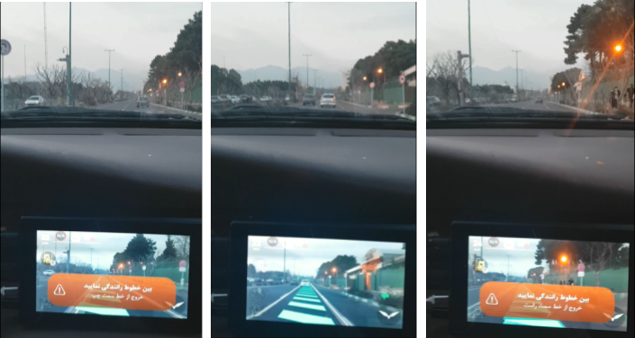
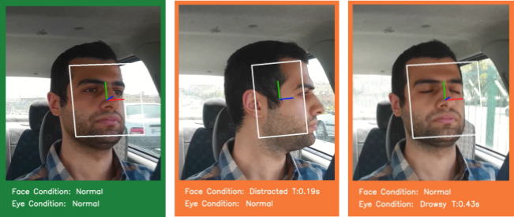
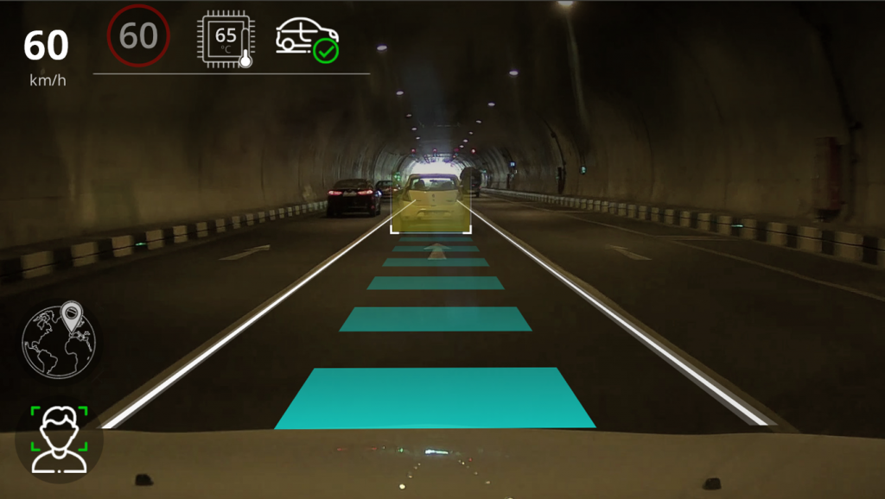
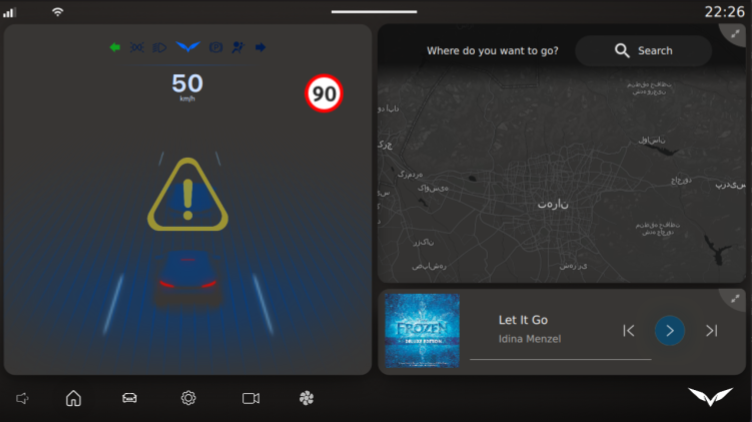
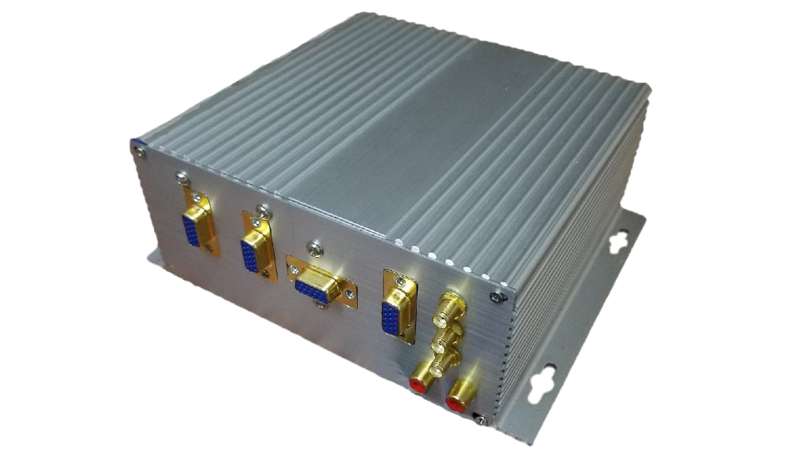
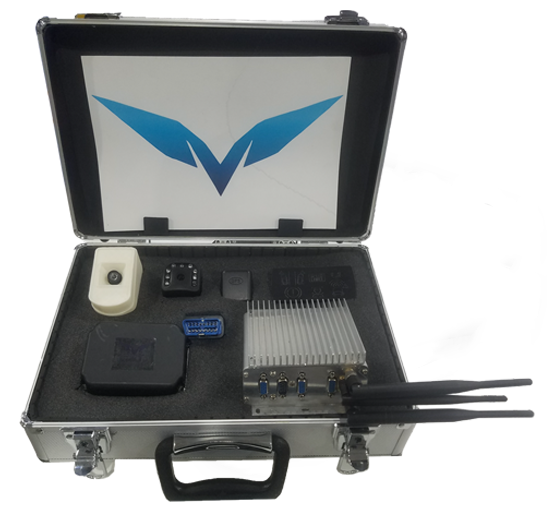

# AutoRoBox

As a Robotics Engineer, I led the design and development of a Lane Departure Warning System (LDWS) compliant with industry regulations (EU) No 351/2012, ECE R10, and IEC 60068-2-27, integrating cutting-edge computer vision AI models using ONNX and PyTorch. I also contributed to an Advanced Driver Assistance System (ADAS) by implementing LDWS, Forward Collision Warning (FCW), and Driver Monitoring System, leveraging OpenCL and CUDA for efficient AI model processing. I used C, C++, and Python for software development. I spearheaded the creation of CANnect, a safety-compliant tool for ADAS, enabling data reception and command transmission using the CAN protocol. Additionally, I implemented control algorithms, including PID and model predictive control, to steer vehicles based on vision AI model data.



